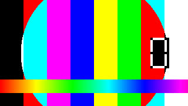

## PNG image

## JPEG image

## WebP image

## GIF image

## Image with a title

## Image inside a link

## YouTube embed

[Getting started video](https://www.youtube.com/watch?v=Qc83dSVe0vQ)

## YouTube short link

[Short link video](https://youtu.be/Qc83dSVe0vQ)

## YouTube embed link

[Embed link video](https://www.youtube.com/embed/Qc83dSVe0vQ)

## YouTube link inside a sentence

Watch [the video inline](https://www.youtube.com/watch?v=Qc83dSVe0vQ) before you continue.

## MP4 video

## WebM video

